<!-- ============================================================
     DEVENDRA RAJPUROHIT — GitHub Profile README
     Spider-Man Theme · Black / Red / White Palette
     Setup: Repo name must match your GitHub username → DevendraRaj58
     ============================================================ -->

<!-- ── ANIMATED HEADER ── -->

  

<!-- ── PROFILE VIEWS + QUICK BADGES ── -->

  
  &nbsp;
  
  &nbsp;
  

<!-- ═══════════════════════════════════════════════════════════
     🕷️  WHO AM I?
════════════════════════════════════════════════════════════ -->

## 🕷️ &nbsp;WHO AM I?

Final-year **B.Tech student in Artificial Intelligence & Data Science** at Ajeenkya DY Patil University, Pune (CGPA **8.8/10**, Batch 2023–2027).

I enjoy building intelligent systems that solve real-world problems—from traditional machine learning pipelines to modern Agentic AI and Retrieval-Augmented Generation (RAG) applications. My interests lie in AI Engineering, Generative AI, Data Science and scalable cloud deployment on AWS.

 

<!-- ═══════════════════════════════════════════════════════════
     ⚡  TECH ARSENAL
════════════════════════════════════════════════════════════ -->

## ⚡ &nbsp;TECH ARSENAL

**🐍 &nbsp;Core Languages & Data**

**🤖 &nbsp;Machine Learning & Deep Learning**

**🧠 &nbsp;LLM · GenAI · Agentic AI**

**🚀 &nbsp;MLOps · Cloud · Deployment**

**🗄️ &nbsp;Databases**

 

<!-- ═══════════════════════════════════════════════════════════
     🕸️  PROJECTS
════════════════════════════════════════════════════════════ -->

## 🕸️ &nbsp;PROJECTS

> *Every great power needs a deployment pipeline.*

| &nbsp; | Project | One-liner | Stack Highlights |
|:---:|:---|:---|:---|
| 🌾 | **[DhartiQ](https://github.com/DevendraRaj58/Dharti-Q)** | Multi-agent Telegram bot that gives crop advisory using real-time weather, web search, and farmer-context RAG — built at Hackron 2.0 (Top 10 / 150+ teams). | LangGraph · GPT-4.1-mini · OpenWeather · Tavily · MySQL |
| 🏦 | **[Loan Intelligence Platform](https://github.com/DevendraRaj58/Loan-Intelligence-Platform)** | Explainable credit risk prediction system built on ~355K Home Credit records using advanced feature engineering, ensemble ML, and hyperparameter optimization to predict loan defaults. | Python · Pandas · Scikit-learn · XGBoost · LightGBM · Random Forest · Bayesian Optimization |
| 🔥 | **[Fire Weather Index Prediction](https://github.com/DevendraRaj58/Fire_Weather_Index-Prediction)** | End-to-end ML system predicting forest fire risk from meteorological data, with a Flask REST API deployed on AWS Elastic Beanstalk via CodePipeline CI/CD. | Ridge Regression · Flask · AWS EB · CodePipeline · ECR |
| 📜 | **[Customer Churn Prediction](https://github.com/DevendraRaj58/Customer-Churn-Prediction)** | End-to-end ML pipeline to predict telecom customer churn using EDA, feature engineering, model comparison, hyperparameter tuning, and Streamlit deployment. | Python · Pandas · NumPy · Scikit-learn · Streamlit · Joblib · Matplotlib · Seaborn |
| ♻️ | **[IndiaEwasteDisposal](https://github.com/DevendraRaj58/IndiaEwasteDisposal)** | Web platform providing structured information on e-waste disposal centres and responsible recycling practices across India. | HTML · CSS · JavaScript |

<!-- ═══════════════════════════════════════════════════════════
     📊 GITHUB STATS
════════════════════════════════════════════════════════════ -->

## 📊 GitHub Stats

<!-- ═══════════════════════════════════════════════════════════
     🏆  WALL OF FAME
════════════════════════════════════════════════════════════ -->

## 🏆 &nbsp;WALL OF FAME

&nbsp;🥇 &nbsp;**National-Level Hackathon-Ideathon Winner** &nbsp;`2025`

&nbsp;🕸️ &nbsp;**Top 10 out of 150+ teams — Hackron 2.0** &nbsp;`DhartiQ · Agentic Crop Advisory Bot`

&nbsp;🏆 &nbsp;**Smart India Hackathon Winner (Internal)** &nbsp;`AI WhatsApp Assistant for Farmers`

&nbsp;📈 &nbsp;**CGPA 8.8 / 10** &nbsp;`B.Tech AI & Data Science`

 

<!-- ═══════════════════════════════════════════════════════════
     🔗  FIND ME IN THE MULTIVERSE
════════════════════════════════════════════════════════════ -->

## 🔗 &nbsp;FIND ME IN THE MULTIVERSE

  
  &nbsp;
  
  &nbsp;
  
  &nbsp;
  

<!-- ═══════════════════════════════════════════════════════════
     FOOTER
════════════════════════════════════════════════════════════ -->

 

 

 

**⚡ &nbsp;Thanks for swinging by. Let's build something remarkable. &nbsp;⚡**

 

  

<!-- ── end of README ── -->
